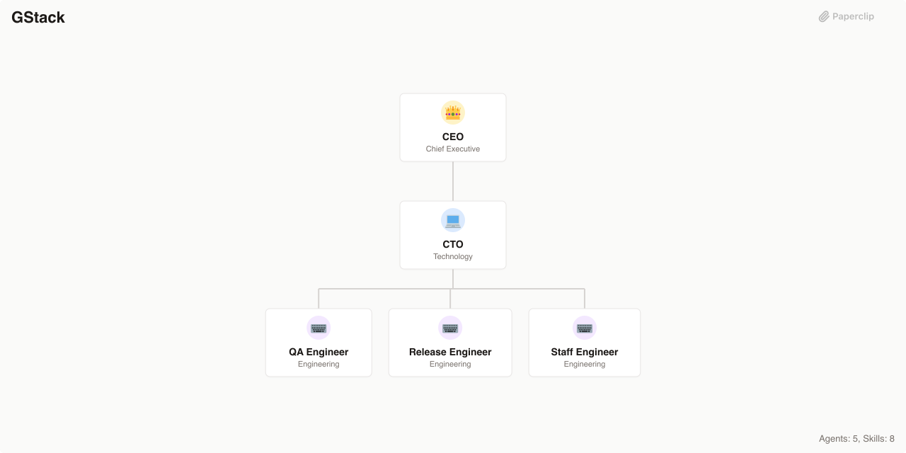

# GStack

> Engineering company powered by gstack workflow skills — distinct cognitive modes for product vision, design critique, technical planning, security auditing, code review, shipping, deployment, and QA

> An [Agent Company](https://agentcompanies.io) based on [gstack](https://github.com/garrytan/gstack) — engineering workflow skills for headless browsing, QA testing, PR review, shipping, retrospectives, and plan reviews



## What's Inside

> This is an [Agent Company](https://agentcompanies.io) package from [Paperclip](https://paperclip.ing)

| Content | Count |
|---------|-------|
| Agents | 5 |
| Skills | 27 |

### Agents

| Agent | Role | Reports To |
|-------|------|------------|
| CEO | CEO | — |
| CTO | CTO | ceo |
| QA Engineer | Engineer | cto |
| Release Engineer | Engineer | cto |
| Staff Engineer | Engineer | cto |

### Skills

| Skill | Description | Source |
|-------|-------------|--------|
| autoplan | Fully automated review pipeline: CEO, Design, and Eng reviews with auto-decisions. | [github](https://github.com/garrytan/gstack/blob/main/autoplan/SKILL.md) |
| benchmark | Performance regression detection — TTFB, FCP, LCP, bundle sizes, request counts. | [github](https://github.com/garrytan/gstack/blob/main/benchmark/SKILL.md) |
| browse | Headless Chromium CLI for QA testing and site dogfooding. | [github](https://github.com/garrytan/gstack/blob/main/SKILL.md) |
| canary | Post-deploy monitoring — watches live app for console errors, perf regressions, visual anomalies. | [github](https://github.com/garrytan/gstack/blob/main/canary/SKILL.md) |
| careful | Warns before destructive commands (rm -rf, DROP TABLE, force-push, etc.). | [github](https://github.com/garrytan/gstack/blob/main/careful/SKILL.md) |
| codex | Multi-AI second opinion via OpenAI Codex CLI — review, challenge, consult modes. | [github](https://github.com/garrytan/gstack/blob/main/codex/SKILL.md) |
| cso | Infrastructure-first security audit across 14 phases including OWASP Top 10 and STRIDE. | [github](https://github.com/garrytan/gstack/blob/main/cso/SKILL.md) |
| design-consultation | Build a complete design system from scratch with competitive research. | [github](https://github.com/garrytan/gstack/blob/main/design-consultation/SKILL.md) |
| design-review | Live-site visual QA audit with fix loop — 10-category checklist, AI slop detection. | [github](https://github.com/garrytan/gstack/blob/main/design-review/SKILL.md) |
| document-release | Post-ship documentation sync — README, ARCHITECTURE, CHANGELOG, TODOS, VERSION. | [github](https://github.com/garrytan/gstack/blob/main/document-release/SKILL.md) |
| freeze | Restricts file edits to a specified directory via pre-tool hooks. | [github](https://github.com/garrytan/gstack/blob/main/freeze/SKILL.md) |
| gstack-upgrade | Self-update mechanism with escalating snooze backoff. | [github](https://github.com/garrytan/gstack/blob/main/gstack-upgrade/SKILL.md) |
| guard | Combines careful + freeze — destructive command warnings plus edit boundary enforcement. | [github](https://github.com/garrytan/gstack/blob/main/guard/SKILL.md) |
| investigate | Systematic root-cause debugging — no fixes without root cause investigation first. | [github](https://github.com/garrytan/gstack/blob/main/investigate/SKILL.md) |
| land-and-deploy | Merge PR, wait for deploy, verify production health — auto-detects platform. | [github](https://github.com/garrytan/gstack/blob/main/land-and-deploy/SKILL.md) |
| office-hours | YC Office Hours — product idea diagnostic before writing code. | [github](https://github.com/garrytan/gstack/blob/main/office-hours/SKILL.md) |
| plan-ceo-review | CEO/founder-mode plan review — 10 review sections, nuclear scope challenge. | [github](https://github.com/garrytan/gstack/blob/main/plan-ceo-review/SKILL.md) |
| plan-design-review | Design critique with 7 rated passes including AI slop risk detection. | [github](https://github.com/garrytan/gstack/blob/main/plan-design-review/SKILL.md) |
| plan-eng-review | Eng manager-mode plan review — architecture, test coverage, performance. | [github](https://github.com/garrytan/gstack/blob/main/plan-eng-review/SKILL.md) |
| qa | Systematically QA test a web app with browser-based bug fixing — 4 modes. | [github](https://github.com/garrytan/gstack/blob/main/qa/SKILL.md) |
| qa-only | Report-only QA — documents bugs with screenshots and repro steps, no code changes. | [github](https://github.com/garrytan/gstack/blob/main/qa-only/SKILL.md) |
| retro | Weekly engineering retrospective — commit analysis, per-person breakdowns, shipping streaks. | [github](https://github.com/garrytan/gstack/blob/main/retro/SKILL.md) |
| review | Pre-landing PR review — two-pass checklist, adversarial review, scope drift detection. | [github](https://github.com/garrytan/gstack/blob/main/review/SKILL.md) |
| setup-browser-cookies | Import cookies from real browsers into headless browse sessions. | [github](https://github.com/garrytan/gstack/blob/main/setup-browser-cookies/SKILL.md) |
| setup-deploy | One-time deployment configuration — detects platform, persists to CLAUDE.md. | [github](https://github.com/garrytan/gstack/blob/main/setup-deploy/SKILL.md) |
| ship | Fully automated ship workflow — tests, reviews, version bump, CHANGELOG, PR. | [github](https://github.com/garrytan/gstack/blob/main/ship/SKILL.md) |
| unfreeze | Removes freeze boundary — hooks remain registered but allow everything. | [github](https://github.com/garrytan/gstack/blob/main/unfreeze/SKILL.md) |

## Getting Started

```bash
npx companies.sh add paperclipai/companies/gstack
```

See [Paperclip](https://paperclip.ing) for more information.

---
Exported from [Paperclip](https://paperclip.ing) on 2026-03-23
